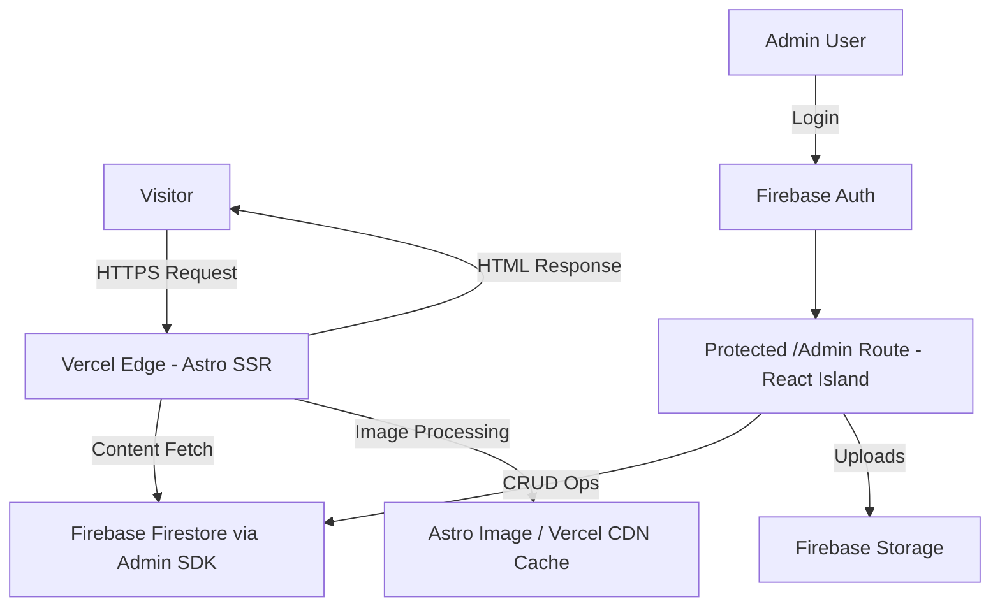

# 🚀 saoudi.online – Personal Portfolio

Material 3 (M3) Dark-Mode personal portfolio strictly constrained to Google Brand Colors, animated using pure CSS and Tailwind utilities on public pages, and server-rendered via Astro with data fetched server-side via the Firebase Admin SDK.

---

## ✨ Key Features

- **Material 3 Dark Mode:** Full M3 visual language — elevation, motion, and geometry — adapted for a deep dark baseline.
- **Google Brand Colors Only:** Palette limited to Google Blue (`#4285F4`), Google Red (`#DB4437`), Google Yellow (`#F4B400`), and Google Green (`#0F9D58`) mapped to M3 roles.
- **Pervasive CSS Animations:** Heavy, expressive motion implemented via CSS `@keyframes` + Tailwind utilities. No external animation libraries on public pages.
- **Server-Side Rendered:** All public routes are rendered via Astro SSR; data fetched on the server with the Firebase Admin SDK.
- **Zero JS for Visitors:** Public routes deliver zero client-side Firebase/animation libraries; the only permitted inline JS is the minimal Base64 contact decoding on explicit activation.
- **Mobile-First Grid & M3 Geometry:** Responsive M3 layouts, rounded panels (`rounded-3xl`) and chips (`rounded-xl`).
- **Admin Dashboard (React island):** Protected `/admin` for authenticated CRUD and image compression.

---

## 🛠️ Tech Stack

- **Framework:** Astro (SSR mode)
- **Styling:** Tailwind CSS + global CSS (`@keyframes`) implementing M3 tokens
- **Animation:** CSS `@keyframes` + Tailwind utilities (public pages only)
- **Admin UI:** React island (`client:only="react"`) confined to `/admin`
- **Database:** Firebase Firestore (Admin SDK; server-side only)
- **Storage:** Firebase Storage (Astro `<Image />` + Vercel CDN)
- **Authentication:** Firebase Auth (Email/Password for admin)
- **Analytics:** Vercel Analytics (server-side)

---

## 🏗️ Architecture & Data Flow

**Firestore Data Schema (Simplified — 2 Collections Only):**

- **`configuration`:** A single document (`static_data`) storing global site settings, profile info, contact details, and persistent `imageSettings` (quality, maxWidth).
- **`entries`:** Unified collection for all portfolio content, rigidly constrained by `type: 'project' | 'experience' | 'volunteering' | 'certificate'` to simplify queries and rendering logic.

---

## 🧭 Architectural Manifest (Engineering Audit)

### Core Architectural Shift

- **Framework Pivot:** Replaced legacy SPA patterns with **Astro SSR** hosted on Vercel.
- **0 KB Public JS Footprint:** Public pages are pure HTML/CSS (animations via CSS only).
- **Admin Workspace Isolation:** Interactive client code and Firebase client SDK are limited to the `/admin` React island.

### Visual & Motion Rules

- **Material 3 Foundation:** Use M3 geometry, elevation, and motion tokens adapted for dark mode.
- **Google-Only Palette:** Only the four Google brand colors above are allowed and must be mapped to M3 roles (primary, secondary, tertiary, error).
- **CSS-Only Motion:** All motion on public pages lives in `src/styles/global.css` and via Tailwind utility classes; no third-party animation libraries.

---

## 🔥 Firebase Free Tier Optimization Strategy (Spark Plan)

## 🔐 Firebase Admin SDK Setup

Use server-only environment variables for the Admin SDK:

- `FIREBASE_PROJECT_ID`
- `FIREBASE_CLIENT_EMAIL`
- `FIREBASE_PRIVATE_KEY`
- `FIREBASE_STORAGE_BUCKET` (optional, for Storage access)

---

## 📂 Firebase Data Schema (Reference)

See `GEMINI.md` for the canonical, synchronized data schema and exact interface definitions for `StaticData` and `PortfolioEntry`. The `configuration` and `entries` two-collection model is the single-authoritative schema.

---

## 🗓️ Roadmap (Synchronized 4-Phase Timeline)

### Phase 1: Foundation & Infrastructure

[x] Astro project setup with SSR mode enabled for Vercel
[x] Tailwind CSS configuration with Material 3 token mapping (Google brand colors only)
[x] Firebase Admin SDK integration (server-side only)
[x] Base layout, Navbar, and responsive navigation
[ ] TypeScript interfaces file (`src/types.ts`)

### Phase 2: Public Pages

[ ] Home page (`/`) — Hero + Stats + Navigation Hub (M3 animated)
[ ] Projects page (`/projects`) — Responsive Grid + URL-based filtering
[ ] Experience page (`/experience`) — Scroll timeline with CSS-only entrance animations
[ ] Volunteering page (`/volunteering`) — GDG & leadership impact with animated metrics
[ ] Certificates page (`/certificates`) — Two-column responsive gallery
[ ] Resume page (`/resume`) — PDF preview + download button

### Phase 3: Admin Dashboard

[ ] Admin layout (React island, isolated from public bundle)
[ ] Firebase Auth login gate for `/admin`
[ ] Dashboard: Edit `static_data` (profile, skills, contact info, imageSettings)
[ ] Dashboard: Full CRUD for `entries` collection
[ ] Dashboard: Resume PDF manager (preview current + strict sequential replace)
[ ] Dashboard: Image compression settings panel (quality, maxWidth controls)
[ ] Firebase Security Rules configuration

### Phase 4: Polish & Launch

[ ] SEO validation (verify OG tags render correctly via server)
[ ] Contact link security (Base64 obfuscation applied to all contact hrefs)
[ ] Vercel Analytics integration
[ ] Performance testing (Lighthouse target: ≥ 90)
[ ] Cross-device testing and final CSS polish
[ ] Production deployment on custom domain

---

## 🤝 Contributor

- **Abderrahmane SAOUDI** - [GitHub](https://github.com/AbderrahmaneSAOUDI)

---

## 📜 License

This project is licensed under the MIT License - see the [LICENSE](LICENSE) file for details.
