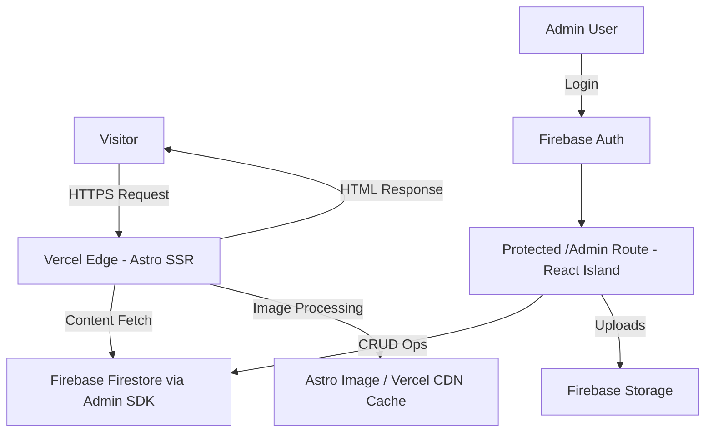

# 🚀 saoudi.online – Personal Portfolio

[](https://astro.build/)
[](https://www.typescriptlang.org/)
[](https://tailwindcss.com/)
[](https://firebase.google.com/)
[](https://vercel.com/)

Premium dark-mode, fully responsive personal portfolio designed with heavy **Glassmorphism** and a modern **Google Developer Program** aesthetic. This site is highly interactive, 100% data-driven via a server-rendered architecture (powered by Firebase Admin SDK), and built for high-impact performance to deliver a futuristic first impression.

---

## ✨ Key Features

- 🌑 **Strictly Dark-Mode:** A focused, futuristic visual experience designed for minimal eye strain and maximum aesthetic impact.
- 🧊 **Premium Glassmorphism:** Heavy use of backdrop blurs, subtle glows, and deep multi-layered surfaces powered by pure Tailwind CSS.
- 🌌 **Animated Mesh Array:** Subtle animated mesh gradient background (CSS-only, no JS).
- 🔠 **Multi-Language Name-Cycling:** Hero section typography gracefully cycles (Arabic → French → English → Tifinagh) using pure CSS animation, sidestepping heavy animation engines like Framer Motion to preserve performance.
- 🚀 **Server-Side Rendered:** 100% server-rendered via Astro — all content fetched from Firestore **on the server**, HTML delivered ready to the browser.
- ⚡ **Zero JS for Visitors:** Zero JavaScript delivered to public visitors (except minimal inline scripts for Base64 contact obfuscation).
- 📱 **Mobile-First CSS Grid:** Fully responsive grid layouts that collapse gracefully on mobile devices.
- 🔐 **Admin Dashboard:** Custom protected `/admin` route with a React Island for real-time CRUD content management directly from the browser.
- 📊 **SEO & Caching:** SEO and Open Graph tags injected server-side. Edge caching protects Firestore read quotas.

---

## 🛠️ Tech Stack

- **Framework:** Astro (SSR mode)
- **Styling:** Tailwind CSS (Native transitions only — no animation libraries)
- **Database:** Firebase Firestore (Server-side reads via Admin SDK)
- **Storage:** Firebase Storage (Images served via Astro `<Image />` + Vercel CDN cache)
- **Admin UI:** React component (island loaded only inside `/admin` via `client:only="react"`)
- **Authentication:** Firebase Auth (Email/Password)
- **Analytics:** Vercel Analytics (Server-side, 0 KB impact on visitors)
- **Deployment:** Vercel (SSR) on custom domain `www.saoudi.online`
- **Typography & Icons:** Custom Google Sans font family & Lucide

---

## 🏗️ Architecture & Data Flow



**Firestore Data Schema (Simplified — 2 Collections Only):**

- **`configuration`:** A single document (`static_data`) that stores all global site settings, including profile info, contact details, and persistent `imageSettings` (controlling `quality` and `maxWidth` values for client-side asset compression).
- **`entries`:** A single unified collection for all dynamic portfolio content, strictly constrained by a `type` literal string field: `'project' | 'experience' | 'volunteering' | 'certificate'`. This architecture eliminates sprawling schemas in favor of high-performance flat queries.

---

## 🧭 Architectural Manifest (Engineering Audit)

### Core Architectural Shift

- **Framework Pivot:** Replaced legacy Vite + React SPA with **Astro SSR** hosted on Vercel.
- **0 KB Public JS Footprint:** Public routes are server-rendered HTML/CSS only, targeting Lighthouse ≥ 90.
- **Admin Workspace Isolation:** Interactive components and the Firebase Client SDK are confined to `/admin` as a React island (`client:only="react"`). Public bundles contain no Firebase client libs.
- **Clean-Slate Strategy:** Repository initialized as a pristine `saoudi_website` to avoid legacy configuration bleed.

### Database & Security Infrastructure

- **Schema Flattening:** Two-collection schema (`configuration` and `entries`).
- **Firebase Server-Side Bypassing:** All public runtime queries run via the Firebase Admin SDK on the server, heavily reducing visitor execution costs.
- **Immutable Security Guardrails:** Firestore and Storage rules restrict writes strictly to a single, explicit admin UID.

### Optimization & Free-Tier Hardening

- **Vercel Edge Cache Protection:** 5-minute TTL edge caching on server-fetched pages to easily absorb arbitrary traffic anomalies.
- **Bandwidth Offloading:** Public images served via Astro `<Image />` (WebP) and Vercel CDN — no raw Storage URLs on public pages.
- **Client-Side Asset Compression Panel:** `compressorjs` enabled only in the admin dashboard uploader to compress images before Firebase dispatch. Configurable targets (quality, maxWidth) seamlessly persist via `imageSettings` established in the `configuration` dataset.

### UI, Content & Mobile Layout Strategy

- **Visual Stability Rules:** No Masonry layouts; utilize native Tailwind Grid layouts with strict, fixed aspect ratios to completely eliminate layout shifts from dynamic content delivery.
- **Fluid Mobile Navigation:** Server-side URL-parameter filtering (e.g., `/projects?type=flutter`) applied firmly at edge level before render.
- **Anti-Scraper Link Obfuscation:** Contact links encoded strictly as Base64 in standard markup, triggering dynamic resolution (`atob()`) exclusively on genuine human interaction limits bot vulnerability.
- **Sequential Resume Management:** Admin-driven strict sequential asset overwrite logic for the resume PDF — the application deliberately calls `deleteObject()` on Firebase Storage to permanently evict the old resume before uploading the new asset to rigorously prevent accumulated file bloat overhead.

---

## 🔥 Firebase Free Tier Optimization Strategy (Spark Plan)

The site is engineered to remain comfortably within the **Firebase Spark Plan** limits for the long term:

- **Reads Protection:** Data is fetched **on the server**. Vercel Edge Cache (5-minute TTL) ensures thousands of visitors trigger **only one** Firestore read every 5 minutes.
- **Writes Protection:** Writes happen singularly via the protected Admin Dashboard.
- **Storage Bandwidth Protection:** All images pass directly through the Astro's `<Image />` component. Vercel CDN caches WebP distributions globally upon initialization.
- **Real-Time Data:** No persistent real-time listeners on public pipelines.
- **No Client SDK:** Zero Firebase SDK JS execution footprint natively presented on public pages.

---

## 🚀 Getting Started

### 1. Prerequisites

- [Node.js](https://nodejs.org/en/) 20.x or higher
- [pnpm](https://pnpm.io/) (recommended package manager)

### 2. Installation & Setup

```bash
# Clone the repository
git clone https://github.com/AbderrahmaneSAOUDI/saoudi.online.git
cd saoudi.online

# Install dependencies
pnpm install

# Setup environment variables (add your Firebase Admin config keys)
cp .env.example .env
```

### 3. Running Locally

```bash
pnpm dev
```

Navigate to `http://localhost:4321` to see the application in action.

---

## 🗓️ Roadmap

### Phase 1: Foundation & Infrastructure

- [x] Astro project setup with SSR mode enabled for Vercel
- [x] Tailwind CSS configuration with Glassmorphism design tokens
- [x] Firebase Admin SDK integration (server-side only)
- [x] Base layout, Navbar, and responsive navigation
- [x] TypeScript interfaces file (`src/types.ts`)

### Phase 2: Public Pages

- [ ] Home page (`/`) — Hero + Stats + Navigation Hub
- [ ] Projects page (`/projects`) — Responsive Grid + URL-based filtering
- [ ] Experience page (`/experience`) — Scroll-animated timeline (CSS-only)
- [ ] Volunteering page (`/volunteering`) — GDG stats and highlights
- [ ] Certificates page (`/certificates`) — Two-column responsive gallery
- [ ] Resume page (`/resume`) — PDF preview + download button

### Phase 3: Admin Dashboard

- [ ] Admin layout (React island, isolated from public bundle)
- [ ] Firebase Auth login gate for `/admin`
- [ ] Dashboard: Edit `static_data` (profile, skills, contact info, imageSettings)
- [ ] Dashboard: Full CRUD for `entries` collection
- [ ] Dashboard: Resume PDF manager (preview current + strict sequential replace)
- [ ] Dashboard: Image compression settings panel (quality, maxWidth controls)
- [ ] Firebase Security Rules configuration

### Phase 4: Polish & Launch

- [ ] SEO validation (verify OG tags render correctly via server)
- [ ] Contact link security (Base64 obfuscation applied to all contact hrefs)
- [ ] Vercel Analytics integration
- [ ] Performance testing (Lighthouse target: ≥ 90)
- [ ] Cross-device testing and final CSS polish
- [ ] Production deployment on custom domain

---

## 🤝 Contributor

- **Abderrahmane SAOUDI** - [GitHub](https://github.com/AbderrahmaneSAOUDI)

---

## 📜 License

This project is licensed under the MIT License - see the [LICENSE](LICENSE) file for details.
