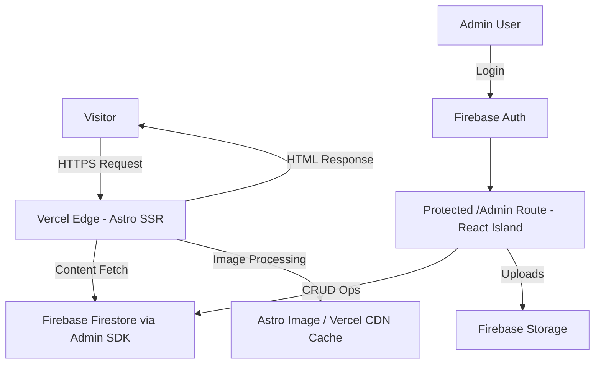

# 🚀 saoudi.online – Personal Portfolio

[](https://astro.build/)
[](https://www.typescriptlang.org/)
[](https://tailwindcss.com/)
[](https://firebase.google.com/)
[](https://vercel.com/)

> [!NOTE]
> This document is **the single source of truth** and the AI-assistant guide for the visual system and architecture for Abderrahmane SAOUDI's official personal portfolio website. All visual decisions below are final and must be strictly respected for public pages.

---

## 📋 Project Overview

- **Description:** A Material 3 (M3) Dark-Mode personal portfolio driven by strict Google Brand Color tokens, server-rendered via Astro, and animated exclusively with pure CSS and Tailwind utilities on public pages. No external animation libraries or client-side JS frameworks are permitted on public routes.
- **Target Audience:** Tech recruiters, startup founders, GDG/community leaders, and potential collaborators.
- **Goal:** Deliver a fast, highly animated M3-driven dark experience with strict color constraints and zero client JS footprint for public visitors while preserving an interactive, admin-only React island for content management.

---

## ✨ Key Features (M3 Visual Core)

- **Material 3 Dark Mode:** The entire visual language follows M3 geometry, elevation, and motion principles adapted for a dark theme.
- **Strict Google Brand Colors Only:** The color system is explicitly limited to Google Blue (`#4285F4`), Google Red (`#DB4437`), Google Yellow (`#F4B400`), and Google Green (`#0F9D58`) mapped to M3 token roles.
- **Heavy, Pervasive CSS Animations:** All motion is implemented with CSS `@keyframes` and Tailwind utility classes (`transition-all`, `duration-300`, custom `cubic-bezier` easings). Public pages deliver zero JS beyond minimal, audited inline decoding for Base64 contact obfuscation.
- **Zero External Animation Libraries:** No Framer Motion, GSAP, or third-party animation libraries on public routes.
- **Zero JS for Visitors:** Public routes deliver zero client-side Firebase/animation libraries; the only permitted inline JS is the minimal Base64 contact decoding on explicit activation.
- **Mobile-First Grid & M3 Geometry:** Responsive M3 layouts, rounded panels (`rounded-3xl`) and chips (`rounded-xl`).
- **Admin Island (React):** Full CRUD, authentication, and client-side image compression (`compressorjs`) remain isolated to `/admin`.

---

## 🛠️ Tech Stack

| Layer | Technology | Notes |
| :---- | :--------- | :---- |
| **Framework** | Astro (SSR mode) | Server-rendered HTML delivered from Vercel Edge |
| **Styling** | Tailwind CSS + global.css | Material 3 token mapping implemented in Tailwind + CSS `@keyframes` for ambient motion |
| **Interactivity** | Pure CSS + Tailwind utilities (public routes) | All public animations via CSS only; zero JS for visitors |
| **Admin UI** | React component (island) | Loaded only inside `/admin` via `client:only="react"` for CRUD and image compression |
| **Database** | Firebase Firestore (Admin SDK) | Server-side reads via Admin SDK only |
| **Storage** | Firebase Storage | Images served via Astro `<Image />` + Vercel CDN cache |
| **Authentication** | Firebase Auth (Email/Password) | Admin-only login for `/admin` |
| **Analytics** | Vercel Analytics | Server-side, 0 KB impact on visitors |
| **Deployment** | Vercel (SSR) | Custom domain `www.saoudi.online` |

### ❌ Explicitly Removed (Do Not Re-add)

- Framer Motion, GSAP, or any animation libraries on public pages
- Global React on public routes (React confined to `/admin` island)
- Masonry layout libraries
- Client-side Firebase SDK usage on public pages

---

## 🎨 Design System & Visual Rules

### 1. Material 3 & Strict Google Color Token Foundations

- **The Palette Constraint:** The entire application color spectrum is restricted to the official Google Brand Colors:
  - Google Blue: `#4285F4`
  - Google Red: `#DB4437`
  - Google Yellow: `#F4B400`
  - Google Green: `#0F9D58`

- **M3 Dark Mapping** (recommended tonal mapping using high-contrast desaturated shifts):
  - Primary / Accent: Google Blue (use an M3 Dark Accent variant near tone 80–90 for contrast)
  - Secondary / Surface Accents: Google Green (surface accents and interactive indicators)
  - Tertiary / Highlights: Google Yellow (highlight strokes and subtle emphasis)
  - Error / Alerts: Google Red (validation, destructive actions)

- **Background & Surfaces:** Use a deep, solid dark baseline such as `#141218` for the app background. Component surfaces use explicit M3 elevation containers: `Surface Container Low`, `Surface Container`, and `Surface Container High` implemented as solid tonal surfaces (no translucent glass effects).

- **Geometry:** Strict M3 curvature: expressive rounded geometry is required — use `rounded-3xl` for primary panels and `rounded-xl` for chips, buttons, and badges.

### 2. Heavy Animation Infrastructure (CSS & Tailwind Only)

- **Animated Background:** A persistent, ambient background animation implemented in `src/styles/global.css` using CSS `@keyframes` (e.g., slow-floating geometric forms or ambient radial pulses). Shapes must be tinted only with soft Google brand tones at very low opacity.

- **Hover & Interaction:** Every card, button, link, and chip must use Tailwind-native transitions for expressive feedback: `transition-all duration-300 ease-in-out`, combined with M3-like elevation changes (`hover:-translate-y-1.5`, `hover:shadow-lg`) and ring indicators (`hover:ring-2 hover:ring-primary/40`). Use color overlay shifts such as `hover:bg-[rgba(66,133,244,0.06)]` to indicate primary-tinted feedback.

- **Motion Easing & Entrance:** Use M3-appropriate easing via Tailwind (`ease-in-out`) or explicit `cubic-bezier(0.2, 0.0, 0.2, 1)` when necessary. Staggered entrance animations for lists/grids must be implemented via accessible CSS animation-delay utilities (no JS staggering).

### 3. Accessibility & Contrast

- Ensure WCAG AA contrast for text and UI elements on the chosen dark background. Use tonal shifts (Tones 80–90) for readable surface/label contrasts.

### 4. Tokens & Tailwind Integration

- All color tokens must be declared in the Tailwind config as M3 roles (e.g., `--md-sys-color-primary`, `--md-sys-color-on-primary`, `--md-sys-color-surface`, etc.), and reference only the four Google brand hues with tonal adjustments. Global CSS `@keyframes` are the single source of motion definitions.

---

## 🏗️ Architecture & Data Flow



### Key Constraints

- **Astro SSR Output Mode:** Public routes are server-rendered HTML with zero client-side Firebase SDK usage.
- **Isolated Admin Workspace:** `/admin` remains the only route that loads the Firebase Client SDK and runs client-side JS (React island); all image compression using `compressorjs` is confined there.
- **Unified Two-Collection Schema:** Keep the `configuration` singleton and the `entries` collection with the strict literal `type` constraint (`'project' | 'experience' | 'volunteering' | 'certificate'`).
- **Anti-Spam & Asset Logic:** Base64 contact link obfuscation remains for public pages; resume file flow remains strict: call `deleteObject()` before `uploadBytes()` when replacing the resume PDF from the admin UI.

---

## 🧭 Architectural Manifest (Engineering Audit)

### Core Architectural Shift

- **Framework Pivot:** Replaced legacy SPA patterns with **Astro SSR** hosted on Vercel.
- **0 KB Public JS Footprint:** Public pages are pure HTML/CSS (animations via CSS only).
- **Admin Workspace Isolation:** Interactive client code and Firebase client SDK are limited to the `/admin` React island.

### Visual & Motion Rules

- **Material 3 Foundation:** Use M3 geometry, elevation, and motion tokens adapted for dark mode.
- **Google-Only Palette:** Only the four Google brand colors above are allowed and must be mapped to M3 roles (primary, secondary, tertiary, error).
- **CSS-Only Motion:** All motion on public pages lives in `src/styles/global.css` and via Tailwind utility classes; no third-party animation libraries.

---

## 📂 Firebase Data Schema (Simplified — 2 Collections Only)

### Collection 1: `configuration` (single document: `static_data`)

Stores global site settings, profile info, and persistent admin configurations.

```typescript
interface StaticData {
      name: string;
      title: string;
      bio: string;
      skills: string[];
      resumeUrl: string;
      contact: {
            email: string; // stored plain; obfuscated at render time
            telegram: string;
            whatsapp: string;
      };
      imageSettings: {
            quality: number;
            maxWidth: number;
      };
}
```

### Collection 2: `entries` (dynamic, all portfolio items)

Unified collection for all portfolio content, differentiated only by a constrained `type` literal.

```typescript
interface PortfolioEntry {
      id: string;
      type: 'project' | 'experience' | 'volunteering' | 'certificate';
      title: string;
      description: string;
      dateOrPeriod: string;
      imageUrl?: string;
      tags?: string[];
}
```

**No other collections should be created.** The `type` literal is the only layout differentiator.

---

## 🔥 Free-Tier & Optimization Rules (Spark Plan)

- Server-side reads via Admin SDK with Vercel Edge Cache (5-minute TTL) to protect Firestore read quotas.
- No persistent real-time listeners on public pipelines.
- Images uploaded via the admin island are compressed client-side (`compressorjs`) and served via Astro `<Image />` with Vercel CDN caching.

---

## 🔐 Firebase Admin SDK Setup

Use server-only environment variables for the Admin SDK:

- `FIREBASE_PROJECT_ID`
- `FIREBASE_CLIENT_EMAIL`
- `FIREBASE_PRIVATE_KEY`
- `FIREBASE_STORAGE_BUCKET` (optional, for Storage access)

---

## 🔒 Admin Security

- Authentication: Firebase Email/Password for the admin user.
- Firestore and Storage rules should restrict writes to the designated admin UID.

---

## 🔐 Contact Link Security (Anti-Spam)

- All public contact hrefs must be Base64-encoded in the HTML and decoded only via a minimal inline `atob()` action on explicit user activation. This inline script is the only permitted inline JS on public pages.

---

## 💡 Notes for Implementers

- Global motion definitions live in `src/styles/global.css` as the canonical CSS `@keyframes` for ambient background shapes and entrance/stagger animations.
- Tailwind utility classes should be the primary interface for motion and state transitions on public UI components.
- Keep the admin island as the single allowed source of client-side JavaScript for content management tasks, compression, and authenticated uploads.

---

## 🗓️ Roadmap (Synchronized 4-Phase Timeline)

### Phase 1: Foundation & Infrastructure

[x] Astro project setup with SSR mode enabled for Vercel
[x] Tailwind CSS configuration with Material 3 token mapping (Google brand colors only)
[x] Firebase Admin SDK integration (server-side only)
[x] Base layout, Navbar, and responsive navigation
[x] TypeScript interfaces file (`src/types.ts`)

### Phase 2: Public Pages

[ ] Home page (`/`) — Hero + Stats + Navigation Hub (M3 animated)
[ ] Projects page (`/projects`) — Responsive Grid + URL-based filtering
[ ] Experience page (`/experience`) — Scroll timeline with CSS-only entrance animations
[ ] Volunteering page (`/volunteering`) — GDG & leadership impact with animated metrics
[ ] Certificates page (`/certificates`) — Two-column responsive gallery
[ ] Resume page (`/resume`) — PDF preview + download button

### Phase 3: Admin Dashboard

[ ] Admin layout (React island, isolated from public bundle)
[ ] Firebase Auth login gate for `/admin`
[ ] Dashboard: Edit `static_data` (profile, skills, contact info, imageSettings)
[ ] Dashboard: Full CRUD for `entries` collection
[ ] Dashboard: Resume PDF manager (preview current + strict sequential replace)
[ ] Dashboard: Image compression settings panel (quality, maxWidth controls)
[ ] Firebase Security Rules configuration

### Phase 4: Polish & Launch

[ ] SEO validation (verify OG tags render correctly via server)
[ ] Contact link security (Base64 obfuscation applied to all contact hrefs)
[ ] Vercel Analytics integration
[ ] Performance testing (Lighthouse target: ≥ 90)
[ ] Cross-device testing and final CSS polish
[ ] Production deployment on custom domain

---

## 🤝 Contributor

- **Abderrahmane SAOUDI** - [GitHub](https://github.com/AbderrahmaneSAOUDI)

---

## 📜 License

This project is licensed under the MIT License - see the [LICENSE](LICENSE) file for details.
