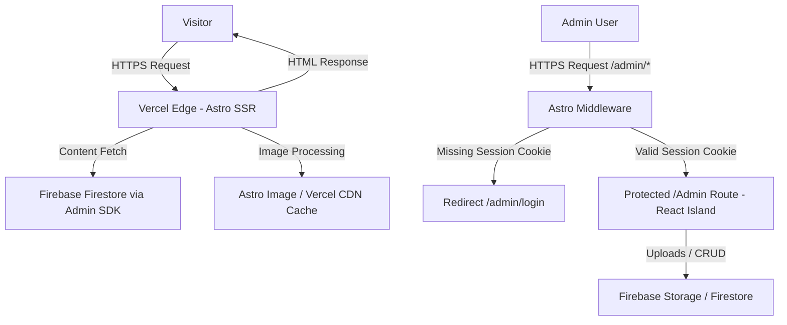

# 🚀 saoudi.online – Personal Portfolio

[](https://astro.build/)
[](https://www.typescriptlang.org/)
[](https://tailwindcss.com/)
[](https://firebase.google.com/)
[](https://vercel.com/)

> [!NOTE]
> This document is **the single source of truth** and the AI-assistant guide for the visual system and architecture for Abderrahmane SAOUDI's official personal portfolio website. All visual decisions below are final and must be strictly respected for public pages.

---

## 📋 Project Overview

- **Description:** A Material 3 (M3) Dark-Mode personal portfolio driven by desaturated dark background colors and strict Google Brand Color tokens. It is server-rendered via Astro, and animated exclusively with pure CSS and Tailwind utilities on public pages. No external animation libraries or client-side JS frameworks are permitted on public routes.
- **Target Audience:** Tech recruiters, startup founders, GDG/community leaders, and potential collaborators.
- **Goal:** Deliver a fast, highly animated M3-driven dark experience with strict accent color constraints and zero client JS footprint for public visitors while preserving an interactive, admin-only React island for content management.

---

## ✨ Key Features (M3 Visual Core)

- **Material 3 Dark Mode:** The entire visual language follows M3 geometry, elevation, and motion principles adapted for a dark theme.
- **Color Palette & Contrast Foundations:** The background uses a solid dark baseline (`#141218`). Component surfaces use explicit M3 elevations (`#1D1B20`, `#211F26`). High-contrast typography is rendered in M3 standard light gray (`#E6E1E5`) and pure white (`#FFFFFF`) for headers. Google Blue (`#4285F4`), Google Red (`#DB4437`), Google Yellow (`#F4B400`), and Google Green (`#0F9D58`) are used strictly as accent/indicator/highlight colors.
- **Heavy, Pervasive CSS Animations:** All motion is implemented with CSS `@keyframes` and Tailwind utility classes (`transition-all`, `duration-300`, custom `cubic-bezier` easings).
- **Zero JS for Visitors:** Public routes deliver absolutely zero client-side JavaScript. Obfuscation of contact links is implemented purely using CSS text-direction reversal and attribute styling.
- **Zero-JS Responsive Navigation:** Public pages avoid hamburger menus. On smaller mobile viewports, navigation links automatically collapse into direct shortcut icons.
- **Admin Workspace (Protected React Island):** Accessible only through server-side Astro middleware route protection. Runs client-side CRUD operations, dynamic real-time dashboard updates, and client-side image compression (`compressorjs`).
- **Universal Floating Administrative Navigation Dock:** Fixed globally across the `/admin` view context to control configurations, navigation, and content initialization.
- **Master-Detail Dashboard Visual Interface (66% / 33% UI Pattern):** A consistent split architecture governing administrative workflows across all content collections.

---

## 🛠️ Tech Stack

| Layer | Technology | Notes |
| :---- | :--------- | :---- |
| **Framework** | Astro (SSR mode) | Server-rendered HTML delivered from Vercel Edge. |
| **Styling** | Tailwind CSS + global.css | M3 token mapping in Tailwind + CSS `@keyframes` for ambient motion. |
| **Interactivity** | Pure CSS + Tailwind utilities | All public animations and layout responsive shifts via CSS only; zero JS. |
| **Admin UI** | React component (island) | Confined inside `/admin` via `client:only="react"` for CRUD, Auth, and compression. Protected from source leak by server-side middleware redirects. |
| **Database** | Firebase Firestore (Admin SDK) | Server-side reads on public routes; client SDK inside `/admin` for real-time CRUD. |
| **Storage** | Firebase Storage | Serves project and design assets. |
| **Image Optimization** | Astro `<Image />` | Dynamic Storage images optimized at request time. **Requires whitelisting `firebasestorage.googleapis.com` under `image.domains` inside `astro.config.mjs` and configuring long-lived Edge cache headers.** |
| **Authentication** | Firebase Auth + Session Cookie | Client-side credentials validation backed by a secure session verification cookie checked by Astro middleware. |
| **Deployment** | Vercel (SSR) | Custom domain `www.saoudi.online`. |

### ❌ Explicitly Removed (Do Not Re-add)

- Framer Motion, GSAP, or any animation libraries on public pages
- Global React on public routes (React confined to `/admin` island)
- Masonry layout libraries
- Client-side Firebase SDK usage on public pages

---

## 🎨 Design System & Visual Rules

### 1. Material 3 & Strict Google Color Token Foundations

- **The Palette Constraint:** The core theme colors use:
  - Theme Background: Deep dark baseline (`#141218`)
  - Theme Surfaces: Tonal containers (`#1D1B20`, `#211F26`, `#2B2930`)
  - Typography: Primary white (`#FFFFFF`) and secondary desaturated gray (`#E6E1E5`)
  - Google Blue: `#4285F4` (Primary accent/active highlights)
  - Google Green: `#0F9D58` (Secondary accents/success states)
  - Google Yellow: `#F4B400` (Highlight borders/stagger indicators)
  - Google Red: `#DB4437` (Error labels/destructive action buttons)

- **M3 Dark Mapping:**
  - Primary / Accent: Google Blue (tone 80–90 shift for contrast)
  - Secondary / Surface Accents: Google Green (surface highlights and active ticks)
  - Tertiary / Highlights: Google Yellow (staggered highlights and notification tags)
  - Error / Alerts: Google Red (validation text, delete confirmations)

- **Surfaces & Layout Opacity:** Component surfaces use solid tonal containers to ensure contrast. However, translucent backgrounds, backdrop blurs, and hover opacity transitions are fully permitted for ambient background pulses and transition effects, provided they are constructed strictly via CSS and Tailwind.

- **Geometry:** Strict M3 curvature: expressive rounded geometry is required — use `rounded-3xl` for primary panels and `rounded-xl` for chips, buttons, and badges.

### 2. Heavy Animation Infrastructure (CSS & Tailwind Only)

- **Animated Background:** A persistent, ambient background animation implemented in `src/styles/global.css` using CSS `@keyframes` (e.g., slow-floating geometric shapes or radial ambient pulses). Shapes are tinted using soft desaturated Google brand accents at low opacity.

- **Hover & Interaction:** Every card, button, link, and chip uses Tailwind-native transitions: `transition-all duration-300 ease-in-out`, combined with M3-like elevation changes (`hover:-translate-y-1.5`, `hover:shadow-lg`) and ring indicators (`hover:ring-2 hover:ring-primary/40`).

- **Motion Easing:** Use M3-appropriate easing via Tailwind (`ease-in-out`) or custom cubic curves (`cubic-bezier(0.2, 0.0, 0.2, 1)`). Staggered entry animations use pure CSS animation-delay utility attributes.

### 3. Accessibility & Contrast

- Ensure WCAG AA contrast for text and UI elements on the chosen dark background. Use desaturated white (`#E6E1E5`) for text body copy to keep reading comfortable.

---

## 🏗️ Architecture & Data Flow



### Key Constraints

- **Astro SSR Output Mode:** Public routes are server-rendered HTML with zero client-side Firebase SDK usage.
- **Isolated Admin Workspace:** `/admin` is the only route running client-side JS (React island) and initializing the Client Firebase SDK. Access is gated by server-rendered middleware checks.
- **Decoupled Multi-Collection Schema:** Content is split across individual Firestore collections (`experience`, `projects`, `designs`, `certificates`, `volunteering`) and configuration documents.
- **Zero-JS Obfuscation:** Public pages hide contact emails and phones using CSS reversed text order (`unicode-bidi: bidi-override; direction: rtl;`) or data attributes styled in pseudo-elements, ensuring crawlers cannot parse details without running JS.

---

## 🧭 The Universal Floating Administrative Navigation Dock

Fixed globally across the `/admin` view context, this layout element offers seamless management across the workspace:

- **Left Slot Anchor:** Universal Image Optimization Engine toggle. Triggers an on-screen overlay control layer housing range sliders and inputs to adjust `compressorjs` parameters (Quality % and Max Width pixels) anywhere on the dashboard. Saving these rules commits them straight to a global storage or document space.
- **Center Segment:** Horizontal grid of textual links routing directly to:
  - Overview
  - Experience
  - Projects
  - Designs
  - Certificates
  - Volunteering
  - Resume
  - Timeline (*Explicitly styled as disabled/future feature*)
  - Global (*Renamed from Settings*)
- **Right Slot Anchor:** Universal Creative Floating Action Button (`+`) styled in Google Blue. When clicked, it activates a drop-down menu asking: "What would you like to create?" Selecting a type instantly routes the user to that workspace page and opens a clear initialization sheet.

---

## 🖥️ Master-Detail Dashboard Visual Interface (The 66% / 33% UI Pattern)

- **Public Routing:** All filtering and searching on public pages trigger native HTTP transitions (full page reloads), maintaining a zero-JS delivery.
- **Admin Routing:** Inside `/admin`, content pages implement a uniform split-screen layout:
  - **Top Dashboard Strip:** Hosts context search inputs along with view toggles that smoothly change the presentation layer from a visual data grid into a text list view.
  - **Left Column Area (66% Width):** Displays a compact list or grid containing current entries. Clicking any card updates URL state query parameters using `history.pushState` without reloading the page.
  - **Right Details Area (33% Width):** Instantly displays the data parameters of the chosen entry inside a full-height editing canvas form layout. Houses Google Green "Update / Save" buttons and Google Red "Delete Item" actions.

### ⚠️ Validation & Resilient UI States

To ensure admin operations do not fail silently or compromise stability:

- **File Size Validation Guard:** The file upload dropzone enforces a strict limit (maximum 10MB) on raw assets *before* passing them to client-side `compressorjs` optimization, rejecting oversized files with clear error states.
- **Upload Progress & Transaction Errors:** The details panel renders visual progress indicators during upload phases and displays distinct error states if a transaction fails.
- **Network Resilience:** The dashboard displays local banner alerts for network disconnection or API request timeouts, preventing layout corruption during transient outages.

---

## 📂 Firebase Data Schema (Decoupled Multi-Collection Blueprint)

To simplify daily scaling, index management, and maintenance as entries grow to 50+ lines per table, the database schema is explicitly split across separate collections.

Dates are stored as standardized **ISO 8601 strings** (`YYYY-MM-DD` or `YYYY-MM`), allowing Firestore to natively sort documents chronologically via simple query configurations (`orderBy("date", "desc")`).

### 1. Configuration Collection (Singleton)

- **Collection:** `configuration`
- **Document ID Name:** `static_data`
- **Array Ceilings:** To prevent Firestore single-document scaling degradation, arrays such as `skills` are capped at a maximum of 100 entries.
- **Data Shape:**

```typescript
interface StaticData {
      id: "static_data";
      name: string;
      title: string;
      bio: string;
      skills: {
            languages: string[];
            frameworks: string[];
            tools: string[];
      }; // Combined fields capped at 100 items max
      resumeUrl: string;
      contact: {
            email: string;
            telegram: string;
            whatsapp: string;
      };
      imageSettings: {
            quality: number;
            maxWidth: number;
      };
}
```

### 2. Content Collections

Five separate database collections structured to align with their distinct properties. All entries contain a standard `id` string and an `order` number for manual prioritization.

#### Collection: `experience`

```typescript
interface Experience {
      id: string;
      order: number; // For manual list ordering
      role: string;
      company: string;
      location: string;
      date: string; // ISO 8601 string (e.g. "2024-01-15") for sorting
      period: string; // Human readable label (e.g. "Jan 2024 - Present")
      descriptionPoints: string[];
      technologies: string[];
}
```

#### Collection: `projects`

```typescript
interface Project {
      id: string;
      order: number;
      title: string;
      tagline: string;
      description: string;
      imageUrl: string; // Remote Firebase Storage URL
      projectUrl: string;
      githubUrl: string;
      date: string; // ISO 8601 (e.g. "2024-05")
      technologies: string[];
      featured: boolean;
}
```

#### Collection: `designs`

```typescript
interface Design {
      id: string;
      order: number;
      title: string;
      description: string;
      imageUrl: string;
      figmaUrl?: string;
      date: string; // ISO 8601
      category: string;
      tags: string[];
}
```

#### Collection: `certificates`

```typescript
interface Certificate {
      id: string;
      order: number;
      title: string;
      issuer: string;
      date: string; // ISO 8601 string for chronological sorting
      period: string; // Display label (e.g. "May 2024")
      credentialUrl: string;
      credentialId?: string;
}
```

#### Collection: `volunteering`

```typescript
interface Volunteering {
      id: string;
      order: number;
      role: string;
      organization: string;
      date: string; // ISO 8601
      period: string;
      description: string;
      impactMetric?: string;
}
```

---

## 🔥 Free-Tier & Optimization Rules (Spark Plan)

- Server-side reads via Admin SDK with Vercel Edge Cache (5-minute TTL) to protect Firestore read quotas.
- No persistent real-time database listeners on public pipelines.
- Images uploaded via the admin island are compressed client-side (`compressorjs`) and served via Astro `<Image />`.
- **Edge Image Cache Conservation:** Astro's optimized outputs for remote image requests are configured with a long-lived `Cache-Control: public, max-age=31536000, immutable` header via Vercel Edge configurations. This ensures images are cached aggressively by Vercel CDN, protecting edge compute minutes and preventing dynamic resizing execution on every unique page view.
- Whitelisting of dynamic image domains inside `astro.config.mjs` allows the server to optimize storage assets automatically.
- **Vercel Serverless Execution Timeout Mitigation:** Because Vercel free-tier hobby accounts impose a strict **10-second serverless execution timeout**, the admin dashboard must avoid proxying large media uploads or file payloads through Astro server endpoints. The admin interface React components must initialize the client Firebase SDK and stream file uploads/deletions directly between the client browser and the Firebase Storage bucket.

---

## 🔐 Firebase Admin SDK Setup

Use server-only environment variables for the Admin SDK:

- `FIREBASE_PROJECT_ID`
- `FIREBASE_CLIENT_EMAIL`
- `FIREBASE_PRIVATE_KEY`
- `FIREBASE_STORAGE_BUCKET`

---

## 🔒 Admin Security

- **Simple Authentication Gate & Server-Side Middleware:** To prevent unauthenticated users from bypassing the UI by manipulating client-side state in the browser developer tools, Astro middleware (`src/middleware.ts`) intercepts any request starting with `/admin` (except `/admin/login`).
- **Verification Flow:** Successful login via Firebase Auth sets a simple, secure verification cookie (e.g., `session`). The server-side Astro middleware reads this cookie on every `/admin` request: if the verification flag is missing or invalid, it triggers a server-side redirect (`context.redirect('/admin/login')`), ensuring layout files, forms, and admin routes are never served to the client browser in an unauthenticated state.
- **Firestore and Storage Rules:** Database security rules strictly restrict Firestore/Storage writes to the designated admin UID.

### 🧹 Cascading Storage Deletion Policy (Preventing Ghost Files)

To prevent data fragmentation and storage bloat inside the Firebase Storage bucket:

- **Deletion Rule:** Whenever a document is deleted from `projects` or `designs` collections, the admin system must programmatically extract the linked `imageUrl` from the database document.
- **Execution Sequence:** The deletion routine must first call the Storage SDK's `deleteObject()` on that image file path before deleting the Firestore database document itself.
- **Upload Cleanup:** If an admin updates a card and uploads a replacement image, the system must invoke `deleteObject()` on the previous image path prior to committing the new `imageUrl`.

---

## 🔐 Contact Link Security (Anti-Spam)

- **Zero-JS CSS Obfuscation:** Public emails/contacts are rendered backwards in HTML and reversed using pure CSS (e.g., `<span class="obfuscated">ed.enilno.iduosas@tcatnoc</span>` with `.obfuscated { unicode-bidi: bidi-override; direction: rtl; }`), preventing email harvesting bots from collecting strings without loading JavaScript.

---

## 💡 Notes for Implementers

- Global motion definitions live in `src/styles/global.css` as the canonical CSS `@keyframes` for ambient background shapes and entrance/stagger animations.
- Tailwind utility classes are the primary interface for motion and state transitions on public UI components.
- Keep the admin island as the single allowed source of client-side JavaScript.

---

## 🗓️ Roadmap (Synchronized 4-Phase Timeline)

### Phase 1: Foundation & Infrastructure

- **Astro & Vercel SSR Setup**
  - [x] Initialize Astro project codebase
  - [x] Install Vercel adapter (`@astrojs/vercel`)
  - [x] Configure Astro in SSR output mode (`output: 'server'`)
  - [x] Set up standard project folder structure (components, layouts, pages)
- **Tailwind & Theme Tokens**
  - [x] Install and configure Tailwind CSS
  - [x] Map Google brand color codes and background darks to CSS variables
  - [x] Set up Material 3 desaturated dark tokens in `tailwind.config.mjs`
  - [x] Register custom `@keyframes` for ambient animations in `global.css`
- **Firebase Admin Integration**
  - [x] Install `firebase-admin` dependency
  - [x] Configure server-only environment variables verification
  - [x] Initialize Firestore and Storage server-side clients
- **Base Layout & Navigation**
  - [x] Build root HTML layout wrapper (`src/layouts/`)
  - [x] Create responsive public navigation header (shortcut icons on mobile, avoiding hamburger menus and JS)
  - [x] Set up global typography and Google Fonts integrations
- **TypeScript Foundation**
  - [x] Define global content interfaces in `src/types.ts`
  - [x] Create Zod schemas for data validation
  - [x] Implement type guard helpers for Firebase schema structures

### Phase 2: Public Pages

- **Home Page (`/`)**
  - [x] Build responsive Hero section layout
  - [x] Set up animated headers and greeting text
  - [x] Code static metrics/stats count grid panel
  - [x] Design visual navigation hub using rounded M3 cards
  - [x] Implement slow-floating radial CSS-only background motion
- **Resume Page (`/resume`)**
  - [x] Build public resume page with preview container and download CTA
  - [x] Add download action button pointing to public asset
  - [ ] Pull live resume document path reference from database
- **Projects Page (`/projects`)**
  - [ ] Build dynamic project card grid layout
  - [ ] Add responsive filter chips for categories/technologies
  - [ ] Implement search/filter URL query parameter tracking (requires full page refresh on public routes)
  - [ ] Apply M3 elevate-and-ring CSS hover effects
- **Experience Page (`/experience`)**
  - [ ] Set up vertical timeline layout tracker
  - [ ] Create responsive experience info card components
  - [ ] Add staggered fade-in entrance transitions via CSS
  - [ ] Render tech tag arrays on each job entry card
- **Volunteering Page (`/volunteering`)**
  - [ ] Structure GDG & community activity timeline layout
  - [ ] Create high-visibility volunteer impact metric banners
  - [ ] Style volunteering project cards using Google brand borders
- **Certificates Page (`/certificates`)**
  - [ ] Design two-column responsive gallery grid layout
  - [ ] Build certificate card with issuer and date tags
  - [ ] Add external verification links to credential actions
- **Designs Page (`/designs`)**
  - [ ] Build visual mockup/UI design grid component
  - [ ] Implement CSS-only lightbox preview modal
  - [ ] Add links referencing Figma project URLs

### Phase 3: Admin Dashboard & Secure Pipelines

- **Authentication & Server-Side Access Middleware**
  - [x] Build standalone `/admin/login` page layout using M3 dark styles
  - [ ] Add visual validation styles on email and password inputs
  - [x] Setup Astro middleware (`src/middleware.ts`) to intercept `/admin` routes (excluding `/admin/login`)
  - [x] Implement secure verification cookie setting upon successful login
  - [x] Program middleware check: read cookie and perform server-side redirect `context.redirect('/admin/login')` if absent
  - [x] Bind login form actions to email/password client validation
  - [ ] Implement Client Firebase Auth SDK state checks inside React island
  - [x] Add sign-out action (clearing verification cookies)
- **Universal Floating Admin Navigation Dock**
  - [ ] Design fixed floating container with absolute viewport tracking
  - [ ] Style active routes using Google Blue pill shape indicators
  - [ ] Map center segments to: Overview, Experience, Projects, Designs, Certificates, Volunteering, Resume, Timeline, and Global
  - [ ] Render "Timeline" link with disabled hover properties
  - [ ] Set up right-anchored Google Blue Creative FAB (`+`)
  - [ ] Code drop-down menu triggered by FAB click
  - [ ] Map FAB drop-down choices to instantly route to workspace initialization sheets
- **Universal Image Optimization Overlay**
  - [ ] Build slide-in control overlay container
  - [ ] Implement range slider for `compressorjs` Quality percentage (1-100)
  - [ ] Create integer validation input field for Max Width in pixels
  - [ ] Wire optimization Save button to commit metrics to configuration store
- **Overview Workspace View**
  - [ ] Set up `/admin/overview` dashboard page layout shell
  - [ ] Build status summary panels for system health
  - [ ] Fetch database collections to count active documents
- **Global Configuration Workspace**
  - [ ] Build `/admin/global` layout view (formerly settings)
  - [ ] Implement input controls for Name, Title, and Bio
  - [ ] Build skill token list editor with delete-chip controls
  - [ ] Create text fields for Email, Telegram, and WhatsApp contacts
  - [ ] Connect global save action to Firestore `configuration/static_data`
- **Workspace Frameworks (All 5 Content Pages)**
  - [ ] Setup page layout wrappers for Experience data views
  - [ ] Setup page layout wrappers for Projects data views
  - [ ] Setup page layout wrappers for Designs data views
  - [ ] Setup page layout wrappers for Certificates data views
  - [ ] Setup page layout wrappers for Volunteering data views
  - [ ] Create top strip with filter searches and Grid/List toggle buttons
  - [ ] Build 66% width left column area showing compact card lists
  - [ ] Intercept card clicks to append active ID to URL query state using `history.pushState`
  - [ ] Build 33% width right column editing panel with save/delete buttons
- **CRUD Systems & File Uploads**
  - [ ] Integrate form state hooks for all field edits
  - [ ] Setup Firebase Storage bucket write permissions
  - [ ] Add dragzone panel for image file uploads (Projects, Designs)
  - [ ] Implement dropzone client-side file size guard (max 10MB limit check) before image processing
  - [ ] Intercept upload stream to apply client-side `compressorjs` optimization rules
  - [ ] Add visual upload progress state bars and upload transaction error handlers
  - [ ] Connect Google Green "Save" triggers to targeted Firestore collections
  - [ ] Program cascading deletion: call Storage `deleteObject()` on linked image path before removing the Firestore document
  - [ ] Implement replacement cleanup: delete the previously referenced image file from Storage when saving a new upload
  - [ ] Add global connection monitor alert banners to indicate timeout and offline states
- **Resume Document Pipeline**
  - [ ] Setup dedicated Resume route view
  - [ ] Create PDF dropzone restricted strictly to `.pdf` extension uploads
  - [ ] Code sequential script to call `deleteObject()` on existing storage path
  - [ ] Code sequential script to upload replacement PDF file via `uploadBytes()`
  - [ ] Update `resumeUrl` on successful replacement
- **Security & Build Optimizations**
  - [ ] Set up Firestore Security Rules locking writes to authenticated Admin UID
  - [ ] Audit build configuration to keep Client Firebase SDK out of public page bundles
  - [ ] Whitelist `firebasestorage.googleapis.com` under `image.domains` in `astro.config.mjs`
  - [ ] Add Cache-Control config rules in astro.config.mjs or Vercel config headers for long-lived image caching

### Phase 4: Polish & Launch

- **SEO & Meta Validations**
  - [ ] Ensure unique metadata titles and descriptions exist on all routes
  - [ ] Implement OpenGraph tags and responsive layout constraints
  - [ ] Inspect server-rendered output to confirm structured markup delivery
- **Contact Security (Anti-Spam)**
  - [ ] Implement zero-JS contact obfuscation using CSS direction reversal
- **Analytics & Performance**
  - [ ] Add server-side Vercel Analytics integration
  - [ ] Perform Lighthouse performance tests to verify scores (target ≥ 90)
  - [ ] Check Core Web Vitals (LCP, FID, CLS metrics)
- **Final Deployment & Handover**
  - [ ] Conduct cross-device responsive design review
  - [ ] Verify custom domain redirection rules
  - [ ] Perform final build deployment on Vercel production hosting

---

## 🤝 Contributor

- **Abderrahmane SAOUDI** - [GitHub](https://github.com/AbderrahmaneSAOUDI)

---

## 📜 License

This project is licensed under the MIT License - see the [LICENSE](LICENSE) file for details.
