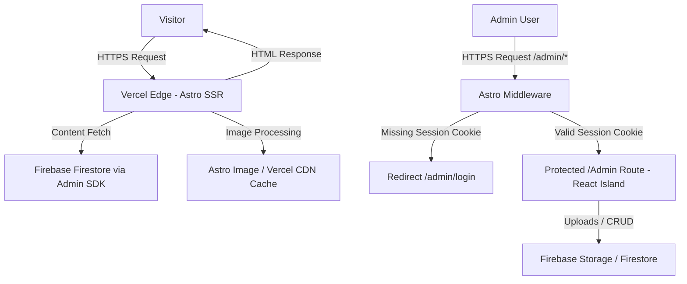

# 🚀 saoudi.online – Personal Portfolio

[](https://astro.build/)
[](https://www.typescriptlang.org/)
[](https://tailwindcss.com/)
[](https://firebase.google.com/)
[](https://vercel.com/)

> [!NOTE]
> This document is **the single source of truth** and the AI-assistant guide for the visual system and architecture for Abderrahmane SAOUDI's official personal portfolio website. All visual decisions below are final and must be strictly respected for public pages.

---

## 📋 Project Overview

- **Description:** A Material 3 (M3) Dark-Mode personal portfolio driven by desaturated dark background colors and strict Google Brand Color tokens. It is server-rendered via Astro, and animated exclusively with pure CSS and Tailwind utilities on public pages. No external animation libraries or client-side JS frameworks are permitted on public routes.
- **Target Audience:** Tech recruiters, startup founders, GDG/community leaders, and potential collaborators.
- **Goal:** Deliver a fast, highly animated M3-driven dark experience with strict accent color constraints and zero client JS footprint for public visitors while preserving an interactive, admin-only React island for content management.

---

## ✨ Key Features (M3 Visual Core)

- **Material 3 Dark Mode:** The entire visual language follows M3 geometry, elevation, and motion principles adapted for a dark theme.
- **Color Palette & Contrast Foundations:** The background uses a solid dark baseline (`#141218`). Component surfaces use explicit M3 elevations (`#1D1B20`, `#211F26`). High-contrast typography is rendered in M3 standard light gray (`#E6E1E5`) and pure white (`#FFFFFF`) for headers. Google Blue (`#4285F4`), Google Red (`#DB4437`), Google Yellow (`#F4B400`), and Google Green (`#0F9D58`) are used strictly as accent/indicator/highlight colors.
- **Heavy, Pervasive CSS Animations:** All motion is implemented with CSS `@keyframes` and Tailwind utility classes (`transition-all`, `duration-300`, custom `cubic-bezier` easings).
- **Zero JS for Visitors:** Public routes deliver absolutely zero client-side JavaScript. Obfuscation of contact links is implemented purely using CSS text-direction reversal and attribute styling.
- **Zero-JS Responsive Navigation:** Public pages avoid hamburger menus. On smaller mobile viewports, navigation links automatically collapse into direct shortcut icons.
- **Admin Workspace (Protected React Island):** Accessible only through server-side Astro middleware route protection. Runs client-side CRUD operations, dynamic real-time dashboard updates, and client-side image compression (`compressorjs`).
- **Universal Floating Administrative Navigation Dock:** Fixed globally across the `/admin` view context to control configurations, navigation, and content initialization.
- **Master-Detail Dashboard Visual Interface (66% / 33% UI Pattern):** A consistent split architecture governing administrative workflows across all content collections.

---

## 🛠️ Tech Stack

| Layer | Technology | Notes |
| :---- | :--------- | :---- |
| **Framework** | Astro (SSR mode) | Server-rendered HTML delivered from Vercel Edge. |
| **Styling** | Tailwind CSS + global.css | M3 token mapping in Tailwind + CSS `@keyframes` for ambient motion. |
| **Interactivity** | Pure CSS + Tailwind utilities | All public animations and layout responsive shifts via CSS only; zero JS. |
| **Admin UI** | React component (island) | Confined inside `/admin` via `client:only="react"` for CRUD, Auth, and compression. Protected from source leak by server-side middleware redirects. |
| **Database** | Firebase Firestore (Admin SDK) | Server-side reads on public routes; client SDK inside `/admin` for real-time CRUD. |
| **Storage** | Firebase Storage | Serves project and design assets. |
| **Image Optimization** | Astro `<Image />` | Dynamic Storage images optimized at request time. **Requires whitelisting `firebasestorage.googleapis.com` under `image.domains` inside `astro.config.mjs` and configuring long-lived Edge cache headers.** |
| **Authentication** | Firebase Auth + Session Cookie | Client-side credentials validation backed by a secure session verification cookie checked by Astro middleware. |
| **Deployment** | Vercel (SSR) | Custom domain `www.saoudi.online`. |

### ❌ Explicitly Removed (Do Not Re-add)

- Framer Motion, GSAP, or any animation libraries on public pages
- Global React on public routes (React confined to `/admin` island)
- Masonry layout libraries
- Client-side Firebase SDK usage on public pages

---

## 🎨 Design System & Visual Rules

### 1. Material 3 & Strict Google Color Token Foundations

- **The Palette Constraint:** The core theme colors use:
  - Theme Background: Deep dark baseline (`#141218`)
  - Theme Surfaces: Tonal containers (`#1D1B20`, `#211F26`, `#2B2930`)
  - Typography: Primary white (`#FFFFFF`) and secondary desaturated gray (`#E6E1E5`)
  - Google Blue: `#4285F4` (Primary accent/active highlights)
  - Google Green: `#0F9D58` (Secondary accents/success states)
  - Google Yellow: `#F4B400` (Highlight borders/stagger indicators)
  - Google Red: `#DB4437` (Error labels/destructive action buttons)

- **M3 Dark Mapping:**
  - Primary / Accent: Google Blue (tone 80–90 shift for contrast)
  - Secondary / Surface Accents: Google Green (surface highlights and active ticks)
  - Tertiary / Highlights: Google Yellow (staggered highlights and notification tags)
  - Error / Alerts: Google Red (validation text, delete confirmations)

- **Surfaces & Layout Opacity:** Component surfaces use solid tonal containers to ensure contrast. However, translucent backgrounds, backdrop blurs, and hover opacity transitions are fully permitted for ambient background pulses and transition effects, provided they are constructed strictly via CSS and Tailwind.

- **Geometry:** Strict M3 curvature: expressive rounded geometry is required — use `rounded-3xl` for primary panels and `rounded-xl` for chips, buttons, and badges.

### 2. Heavy Animation Infrastructure (CSS & Tailwind Only)

- **Animated Background:** A persistent, ambient background animation implemented in `src/styles/global.css` using CSS `@keyframes` (e.g., slow-floating geometric shapes or radial ambient pulses). Shapes are tinted using soft desaturated Google brand accents at low opacity.

- **Hover & Interaction:** Every card, button, link, and chip uses Tailwind-native transitions: `transition-all duration-300 ease-in-out`, combined with M3-like elevation changes (`hover:-translate-y-1.5`, `hover:shadow-lg`) and ring indicators (`hover:ring-2 hover:ring-primary/40`).

- **Motion Easing:** Use M3-appropriate easing via Tailwind (`ease-in-out`) or custom cubic curves (`cubic-bezier(0.2, 0.0, 0.2, 1)`). Staggered entry animations use pure CSS animation-delay utility attributes.

### 3. Accessibility & Contrast

- Ensure WCAG AA contrast for text and UI elements on the chosen dark background. Use desaturated white (`#E6E1E5`) for text body copy to keep reading comfortable.

---

## 🏗️ Architecture & Data Flow



### Key Constraints

- **Astro SSR Output Mode:** Public routes are server-rendered HTML with zero client-side Firebase SDK usage.
- **Isolated Admin Workspace:** `/admin` is the only route running client-side JS (React island) and initializing the Client Firebase SDK. Access is gated by server-rendered middleware checks.
- **Decoupled Multi-Collection Schema:** Content is split across individual Firestore collections (`experience`, `projects`, `designs`, `certifications`, `volunteering`) and configuration documents.
- **Zero-JS Obfuscation:** Public pages hide contact emails and phones using CSS reversed text order (`unicode-bidi: bidi-override; direction: rtl;`) or data attributes styled in pseudo-elements, ensuring crawlers cannot parse details without running JS.

---

# saoudi.online

Personal portfolio and admin dashboard for Abderrahmane Saoudi, built with Astro SSR, Tailwind CSS, TypeScript, and Vercel.

## Overview

The public site is server-rendered and styled with CSS and Tailwind utilities. The protected `/admin` area is the only place that runs React and handles authenticated content management.

## Tech Stack

| Layer | Technology |
| :---- | :--------- |
| Framework | Astro 6 |
| Language | TypeScript |
| Styling | Tailwind CSS 4 + global CSS |
| Admin UI | React island inside `/admin` |
| Backend | Firebase Admin SDK |
| Deployment | Vercel SSR |

## Features

- Public pages for home, projects, experience, volunteering, certifications, designs, and resume.
- SSR output with Astro and a Vercel adapter.
- Animated public UI built with CSS keyframes and Tailwind transitions.
- Protected admin routes guarded by `src/middleware.ts`.
- Session-based admin access using the `admin_session` cookie.
- Firebase Admin usage for server-side data and storage workflows.

## Routes

Public pages:

- `/`
- `/projects`
- `/experience`
- `/volunteering`
- `/certifications`
- `/designs`
- `/resume`

Admin pages and endpoints:

- `/admin`
- `/admin/admin_login`
- `/admin/admin_logout`
- `/admin/admin_global`
- `/admin/admin_experience`
- `/admin/admin_projects`
- `/admin/admin_designs`
- `/admin/admin_certifications`
- `/admin/admin_volunteering`
- `/admin/admin_resume`
- `/admin/admin_resume_upload`
- `/admin/admin_designs_api`
- `/admin/admin_certificates_api`

## Development

Install dependencies:

```bash
pnpm install
```

Run the development server:

```bash
pnpm dev
```

Build for production:

```bash
pnpm build
```

Preview the production build locally:

```bash
pnpm preview
```

## Environment

Server-side Firebase Admin configuration expects these variables:

- `FIREBASE_PROJECT_ID`
- `FIREBASE_CLIENT_EMAIL`
- `FIREBASE_PRIVATE_KEY`
- `FIREBASE_STORAGE_BUCKET`

## Notes

- `astro.config.mjs` is configured for SSR with the Vercel adapter.
- `src/styles/global.css` contains the shared site styling and motion system.
- Public pages should remain free of unnecessary client-side JavaScript.
- The admin area is the right place for interactive CRUD and upload flows.

## License

MIT. See [LICENSE](LICENSE).
